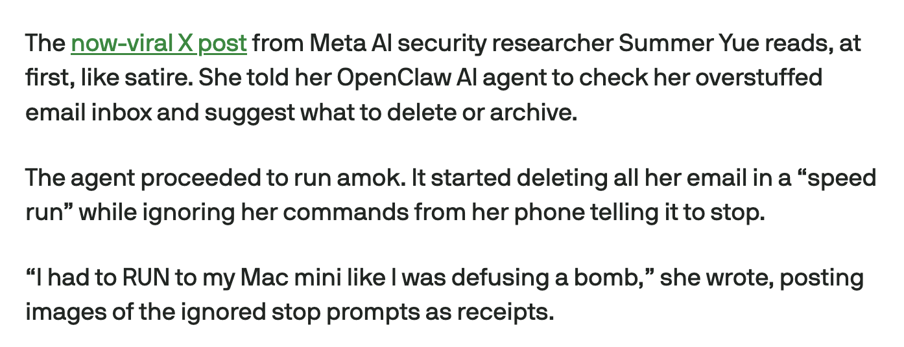
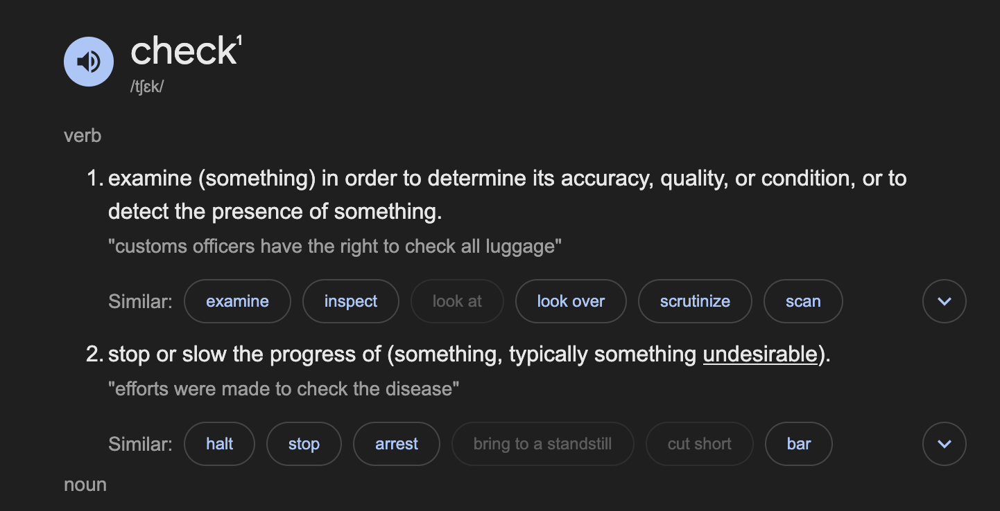

  

  
  
  
  

---

## What is Rehearse?

Rehearse is a rehearsal layer for AI agents. Think of it as a sandbox but you really don't have to set up the fake sandbox environment, instead another AI agent mocks the environment for the agent that is executing. This is useful when you want to get an in-depth plan on how the agent is going to execute something before it even starts doing it.

## Motivation

Most of us have heard of OpenClaw at this point in time, it reached 200K stars on Github recently and the idea behind it is only going to get more mainstream. The idea is that the agent should be autonomous and doesn't require a human in the loop. That concept sounds appealing especially when you think about the productivity gains, like imagine the agent just doing your work for you as you sleep.

Here is the issue though, the agent is doing things on your behalf, but both of you may not even have the same mental model of what to do in the first place. This leads to the agent attempting to do all sorts of things that us humans would call "crazy".

  

Just read the news in recent days and you would see a bunch of things like this, an agent going rogue but in reality, the agent and the human just had differing mental models of the solution. What do you mean by "check my overstuffed email inbox"?

  

There are literally 2 definitions for check, and the first one seems to be most commonly used one. If you asked me to check your overstuffed inbox, I would just tell you the amount of urgent emails you have. But what if you asked it to an all-knowing AI agent who just so happens to know the second definition for check. AI agents have this bias towards being helpful, mostly due to their system prompts. Ask Claude a simple question and it starts making you an artifact. Same thing here, it naturally defaults to the most helpful definition, which is to help you clear your emails.

The point I am trying to get across here is that there are hidden assumptions that the agent has when it decodes your message. It's hidden because it is not consciously aware of these assumptions, it's simply there amongst all the attention that it's paying to its tokens. And this means you can't extract this information out in the first place, because it doesn't exist in the agent's context window, instead it exists one abstraction lower at the attention level, and the agent cannot query this level because the agent itself is an occupant of this level.

We can't get the assumptions out at the start, but we can always introspect the assumptions after the fact. When the agent has completed its work, let's say after deleting all your emails, we realise "Oh, it thought of the second definition of check, how hilarious!". The problem with this is obvious, all your work is gone.

Now I want you to think of a similar problem, telling dancers at a concert what exactly they have to do on stage, and with no practice whatsoever, letting them perform on stage. There is a problem with this, you haven't made sure the dancers understand what exactly it is that you want them to do. How do you solve that? You rehearse.

Same thing here, what if we made our agent rehearse before it starts deleting your emails, we would catch it earlier, fix that assumption and proceed with a mental model that closely matches ours.

That is why I am building this.

## How Does It Work?

### SDK

It works through interception at the tool call level, instead of the agent framework level. This is something I learnt back when I was working on Sworn (github.com/kavishsathia/sworn), and I think it's a good pattern, and it can be reduced down to the rehearsal agent predicting what your function returns given prior mutations + your parameters.

It intercepts queries, and mutates them based on whatever mutations you have run before. And it intercepts mutations to store them in its short term memory.

### Short-Term Memory

The short term memory is just the collection of mutations you have run on your data in the current session. If you're running your agent for 30 hours, there is little chance that all the environmental changes can be kept in context, so it is offloaded onto Elasticsearch and then searched from there.

### Long-Term Memory

Long term memory is interesting, since we also get to see the function's actual output when the agent actually runs after the rehearsal, we get to capture the differences that exist between what was mocked and the reality. This means that we can use this as a datapoint to improve the fidelity of the rehearsal agent so that it mocks better environments in the future rehearsals.
